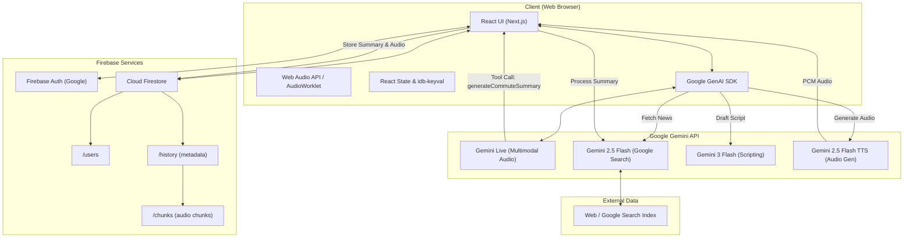

# Commute Zen

Commute Zen is a voice-first news assitant that generates calm, personalized commute briefings from current news across your chosen topics. 

It uses Gemini Live for conversation, Gemini models for search + summarization + text-to-speech, and Firebase for authentication and cloud history.


## Run Locally

Prerequisites: Ensure you have Node.js (v18 or newer) installed.

1. Open your terminal and navigate to your project folder.
2. Install dependencies:

```bash
npm install
```

3. Create a `.env.local` file in the root of your project and add your Gemini API key (you can generate one in Google AI Studio):

```env
NEXT_PUBLIC_GEMINI_API_KEY="your_actual_gemini_api_key_here"
```

4. Start the local development server:

```bash
npm run dev
```

5. Open your browser and go to:

```text
http://localhost:3000
```

## Agent Architecture



## What It Does

- Starts a live voice session with Gemini and asks for your preferred news domains/topics.
- Fetches current topic-specific news with Gemini + Google Search tool.
- Produces a short, podcast-style transcript for commute listening.
- Generates spoken audio and plays it in a custom in-app player.
- Stores transcript + audio history in Firestore when signed in.
- Falls back to local browser storage (IndexedDB) when signed out.

## Tech Stack

- Next.js 15 (App Router) + React 19 + TypeScript
- Google GenAI SDK (`@google/genai`)
- Firebase Auth + Firestore
- Tailwind CSS v4 + Motion (animations)
- idb-keyval (local fallback history persistence)

## How The Flow Works

1. User taps the mic button to start Gemini Live.
2. Live agent asks for topics and calls a tool function (`generateCommuteSummary`).
3. App fetches fresh topic-specific news via Gemini with `googleSearch`.
4. App creates a concise spoken script with Gemini.
5. App converts script to audio using Gemini TTS.
6. App saves summary metadata, transcript, and chunked audio:
	 - Firestore when authenticated
	 - IndexedDB when anonymous

## Project Structure

```text
app/
├─ globals.css                  # Global Tailwind + theme setup
├─ layout.tsx                   # Root layout, fonts, metadata, ErrorBoundary wrapper
└─ page.tsx                     # Main UI + Gemini live flow + summary generation logic

components/
└─ ErrorBoundary.tsx            # Runtime + Firestore-aware UI error boundary

hooks/
└─ use-mobile.ts                # Responsive utility hook

lib/
├─ firebase.ts                  # Firebase app/auth/firestore bootstrap
└─ utils.ts                     # Utility className merger

firestore.rules                 # Firestore security rules
firebase-blueprint.json         # Firestore entity + path blueprint
firebase-applet-config.json     # Firebase client config
```

## Data Model (Firestore)

- `users/{userId}`: profile metadata
- `users/{userId}/history/{historyId}`: one generated summary (metadata + transcript)
- `users/{userId}/history/{historyId}/chunks/{chunkId}`: base64 audio chunks

Security rules enforce:

- Authenticated access only
- Owner-only read/write per user path
- Field validation and size limits
- Immutable field constraints on updates

## Environment Variables

Create a `.env.local` for local development.

- `NEXT_PUBLIC_GEMINI_API_KEY` (required): Gemini API key used by the client
- `APP_URL` (optional for local, used in hosted contexts): app base URL

Reference: `.env.example` includes both keys and comments.

## Available Scripts (Extras)

- `npm run dev` - Start local development server
- `npm run build` - Create production build
- `npm run start` - Run production server
- `npm run lint` - Run ESLint
- `npm run clean` - Project clean script as currently configured

## Notes

- Microphone access is required for live voice interaction.
- Google sign-in popup must be allowed by the browser.
- If Firestore permissions fail, the app surfaces structured diagnostics through the Error Boundary.
- Current creation flow is voice/topic driven (despite some UI text mentioning links).

## Troubleshooting

- "Gemini API key is missing": verify `.env.local` has `NEXT_PUBLIC_GEMINI_API_KEY` and restart dev server.
- Mic button does nothing: check browser mic permissions and HTTPS/localhost context.
- Sign-in fails or closes: allow popups and confirm Firebase Auth provider setup.
- History not loading: verify Firestore rules and that authenticated user owns the data path.
