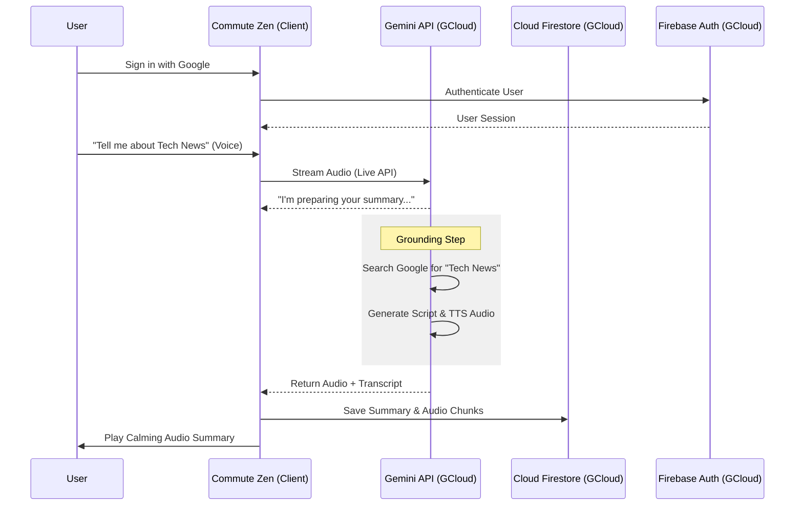
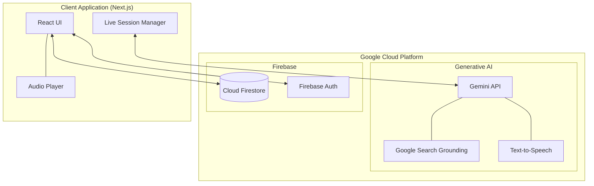

# Google Cloud Usage: Commute Zen Agent

This document outlines how **Commute Zen Agent** leverages Google Cloud services and APIs to provide a personalized, AI-driven news experience.

## Overview

Commute Zen Agent is a full-stack application that transforms news discovery into a calming audio experience. It utilizes Google's most advanced Generative AI models and serverless infrastructure to handle real-time voice interaction, web-scale information retrieval, and persistent data storage.

## Google Cloud Services & APIs

### 1. Gemini API (Generative AI)
The core intelligence of the app is powered by the Gemini API via the `@google/genai` SDK.
- **Real-time Multimodal Interaction**: Uses `gemini-2.5-flash-native-audio-preview` for low-latency voice conversations.
- **Grounding with Google Search**: Uses `gemini-2.5-flash` with the `googleSearch` tool to retrieve the latest news from the web.
- **Content Generation**: Uses `gemini-3-flash-preview` to transform raw news data into polished, conversational podcast scripts.
- **Text-to-Speech (TTS)**: Uses `gemini-2.5-flash-preview-tts` to generate high-quality, expressive audio summaries.

### 2. Cloud Firestore
A flexible, scalable NoSQL cloud database used to store:
- **User Profiles**: Basic metadata for authenticated users.
- **Commute History**: Metadata and transcripts of generated summaries.
- **Audio Chunks**: Large audio files are stored as indexed chunks within Firestore documents for efficient retrieval.

### 3. Firebase Authentication
Provides a secure, easy-to-implement sign-in system.
- **Google Sign-In**: Allows users to securely access their personalized history across devices.

---

## User Flow Diagram

The following diagram illustrates the end-to-end flow of a user request, highlighting the interaction between the client and Google Cloud services.

---

## Architecture Diagram

This diagram shows the structural relationship between the application components and the Google Cloud ecosystem.

## Implementation Reference

- **AI Integration**: See `app/page.tsx` for `GoogleGenAI` initialization and tool usage.
- **Database Logic**: See `app/page.tsx` for Firestore CRUD operations and `lib/firebase.ts` for initialization.
- **Security**: See `firestore.rules` for how data access is governed on Google Cloud's infrastructure.
